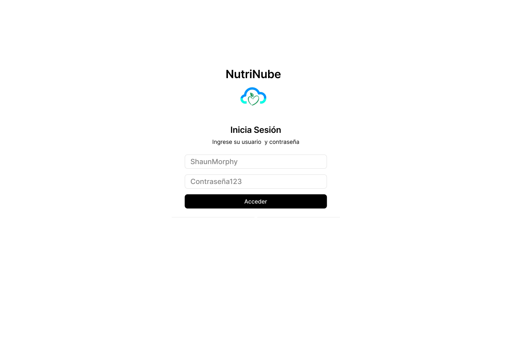
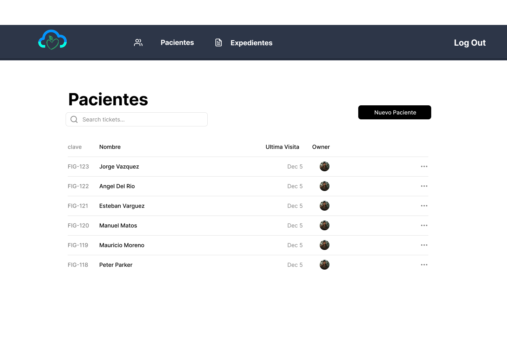
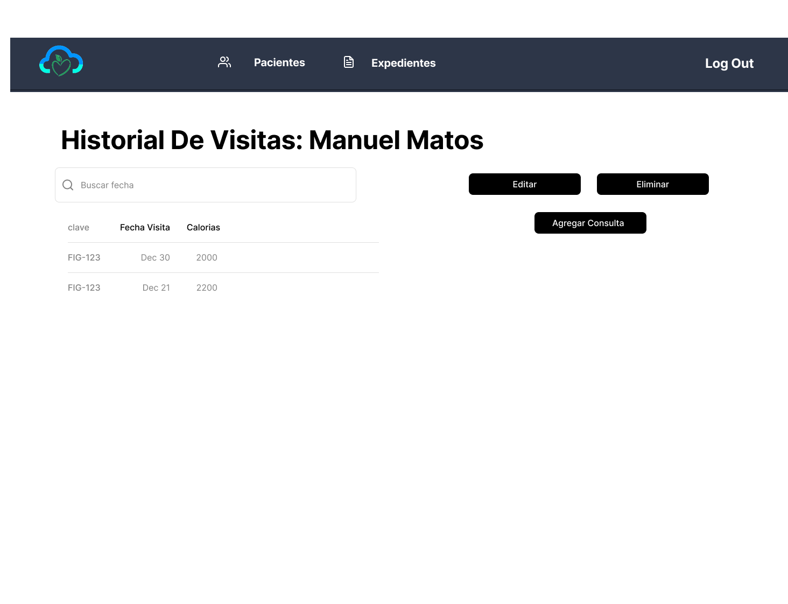

# NutriNube
Repositorio para el proyecto NutriNube

Docente: Edwin Jesús León Bojorquez

## Integrantes:

| Manuel Eduardo Del Rio Camacho | Jorge Gabriel Várguez Suárez | Eduardo José Matos Uc | Cristian De Martino Ricci |
|---|---|---|---|
|  |  |  |  |

##  Plan de Trabajo 

## 🗓️ Plan de Trabajo Inicial: Estructura de Arquitectura General

| Responsable | Tarea | Foco del Desarrollo | Fecha de Inicio | Fecha de Final | Recursos Necesarios |
| :--- | :--- | :--- | :--- | :--- | :--- |
| **Jorge Gabriel Várguez Suárez** | **Construcción de la base de datos** | Establecer la conexión, la inicialización, y los contratos de acceso a la base de datos (SQLite). | 7 de Noviembre de 2025 | 10 de Noviembre de 2025 | Java 17+, Controlador JDBC, SQLite. |
| **Eduardo José Matos Uc, Jorge Gabriel Várguez Suárez** | **Modelo: Lógica de Negocio Central** | Definir la estructura de las entidades de dominio y la implementación de las reglas de negocio críticas (cálculos y seguridad). | 7 de Noviembre de 2025 | 10 de Noviembre de 2025 | Java 17+, Requisitos de Fórmulas Nutricionales, Estándar de Hashing. |
| **Cristian De Martino Ricci** | **Vista: Interfaces de Usuario** | Construir el esqueleto de las interfaces principales (usando Java Swing) y aplicar principios de usabilidad. | 7 de Noviembre de 2025 | 9 de Noviembre de 2025 | Java Swing, Mockups/Prototipos de Interfaces. |
| **Manuel Eduardo Del Rio Camacho** | **Controlador y Arquitectura de Integración** | Definir la estructura de paquetes, configurar el flujo MVC. | 8 de Noviembre de 2025 | 11 de Noviembre de 2025 | Patrón MVC, Arquitectura de 3 Capas. |
| **Todos** | **Pruebas Unitarias** | Validar la lógica de negocio y las operaciones de la base de datos utilizando JUnit. | 9 de Noviembre de 2025 | 11 de Noviembre de 2025 | Java 17+, JUnit 5, Código del Modelo. |

## Mock up del Proyecto

Diseño: https://www.figma.com/design/6CsOqKYLriSnUplBNz01eX/Untitled?node-id=0-1&t=ORVzN7YKdsZklvEt-1
        

## Especificación de Requisitos

Documento: https://alumnosuady-my.sharepoint.com/:w:/g/personal/a20201625_alumnos_uady_mx/ESvydrc-YLVDjnag0MLEuesBB-0LXHslnZZJehdSf8eB6w?e=1rL9gJ

##  Estándar de Programación para NutriNube

Hemos optado por las convenciones de programación estándar para Java para asegurar la coherencia y la mantenibilidad del código.

---

### Convenciones de Nomenclatura (Estándar Java de Oracle)

Para la nomenclatura de paquetes, clases, interfaces, métodos, variables, y constantes, adoptaremos las directrices establecidas por el estándar de Oracle/Sun, que es la base para la gran mayoría de proyectos en el ecosistema Java.

**Referencia Oficial:** [Java Code Conventions](https://www.oracle.com/java/technologies/javase/codeconventions-contents.html)

